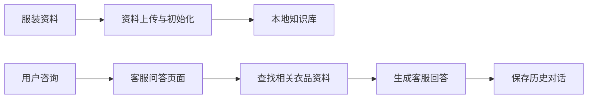
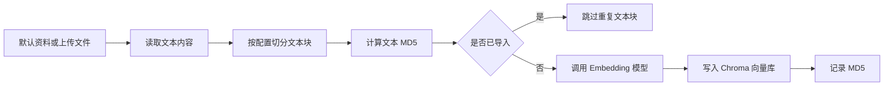
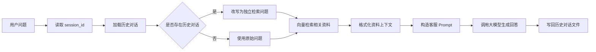

# 服装客服 RAG 项目实现说明

本文档记录 `clothing-customer-service` 子项目的业务目标、模块边界、数据流向和当前实现状态，便于后续复习 LangChain、Chroma、Streamlit 与历史对话结合的 RAG 开发流程。

## 1. 项目定位

`clothing-customer-service` 是一个面向服装客服场景的 RAG 练手项目。项目将商品资料、尺码说明、FAQ 和退换货政策整理为本地知识库，用户在 Web 页面中提问时，系统先检索相关资料，再结合历史对话生成回答。

这个项目主要验证两条链路：

- 离线链路：将默认资料或上传文件切分、去重、向量化，并写入 Chroma。
- 在线链路：用户提问时读取历史会话，必要时改写检索问题，检索资料并生成客服回答。

## 2. 业务流程概览

### 2.1 简化业务流程



### 2.2 离线知识库初始化流程



### 2.3 在线 RAG 问答流程



## 3. 目录结构

```text
clothing-customer-service/
├── app_file_upload.py      # Streamlit 资料上传与默认资料初始化页面
├── app_qa.py               # Streamlit 问答页面，支持历史会话恢复与切换
├── knowledge_base.py       # 文本切分、MD5 去重、知识库写入
├── vector_stores.py        # Chroma 向量库封装，提供 Retriever
├── rag.py                  # RAG 核心服务，组合历史、检索和问答链
├── file_history_store.py   # 基于 JSON 文件的历史消息存储
├── config.py               # 配置读取工具
├── config.json             # 知识库、切分参数、默认资料配置
├── data/                   # 默认资料与 md5.txt
├── chroma_db/              # Chroma 持久化目录
└── chat_history/           # 历史对话持久化目录
```

## 4. 核心模块说明

### 4.1 `app_file_upload.py`

这是资料管理入口，使用 Streamlit 提供 Web 页面。

主要职责：

- 初始化 `KnowledgeBaseService`
- 展示默认资料列表
- 点击按钮后导入 `config.json` 中配置的默认资料
- 支持上传 `txt` 和 `csv` 文件
- 展示导入成功、重复跳过和失败结果

这个页面对应离线流程。它不直接回答用户问题，只负责把资料整理进知识库。

### 4.2 `knowledge_base.py`

这是知识库更新服务，负责从原始文本到 Chroma 写入的完整处理。

主要职责：

- 根据 `config.json` 初始化 `RecursiveCharacterTextSplitter`
- 初始化 Chroma collection
- 对输入内容做空内容保护
- 按 `max_data_length` 判断是否需要切分
- 对每个文本块计算 MD5
- 跳过已经导入过的文本块
- 将新文本块写入 Chroma
- 将新增文本块的 MD5 保存到 `data/md5.txt`

这里的空列表保护很关键。如果所有文本块都已经导入过，`knowledge_chunks` 会是空列表，此时不应该调用 `Chroma.add_texts`，否则底层 upsert 会因为空 embeddings 报错。

### 4.3 `vector_stores.py`

这是向量检索封装层。

主要职责：

- 读取 `config.json`
- 初始化与知识库更新流程相同的 Chroma collection
- 暴露 `get_retriever()` 方法
- 根据 `retriever_k` 控制每次检索返回的资料数量

该模块让 RAG 服务不需要关心 Chroma 的初始化细节，只需要拿到 Retriever。

### 4.4 `rag.py`

这是在线问答核心服务。

主要职责：

- 初始化向量检索服务
- 初始化问答模型
- 根据 `session_id` 读取对应历史记录
- 如果存在历史对话，先将当前问题改写成适合检索的独立问题
- 使用改写后的问题检索知识库
- 将检索结果格式化为 Prompt 上下文
- 生成最终客服回答
- 通过 `RunnableWithMessageHistory` 自动读写历史消息

其中 `RunnableBranch` 用于表达条件分支：有历史对话时走问题改写链路，没有历史对话时直接使用原始问题。`itemgetter("question")` 用于从链路输入字典中取出 `question` 字段，作为后续 Runnable 的输入。

### 4.5 `file_history_store.py`

这是历史对话持久化层。

主要职责：

- 继承 LangChain 的 `BaseChatMessageHistory`
- 将消息对象转换为字典后写入 JSON 文件
- 从 JSON 文件恢复 LangChain 消息对象
- 为不同 `session_id` 保存独立会话文件

这个模块解决了页面刷新后历史消息丢失的问题。`app_qa.py` 会把当前 `session_id` 同步到 URL query params，所以刷新页面后仍能恢复当前对话。

## 5. 配置说明

核心配置在 `clothing-customer-service/config.json` 中。

| 字段 | 含义 |
|------|------|
| `collection_name` | Chroma collection 名称 |
| `embedding-model` | Embedding 模型名称 |
| `persist_directory` | Chroma 持久化目录 |
| `retriever_k` | 每次检索返回的文档数量 |
| `chunk_size` | 文本切分块大小 |
| `chunk_overlap` | 文本块重叠长度 |
| `max_data_length` | 超过该长度后进行文本切分 |
| `separators` | 文本切分分隔符列表 |
| `file_path` | MD5 记录文件路径 |
| `files` | 默认初始化资料列表 |

当前默认资料包括：

- `data/products.csv`
- `data/faq.csv`
- `data/size_guide.csv`
- `data/return_policy.csv`

## 6. 运行方式

在仓库根目录安装依赖：

```bash
cd /Users/suke/Python/Agent
pip install -r requirements.txt
```

启动资料上传与初始化页面：

```bash
streamlit run clothing-customer-service/app_file_upload.py
```

启动客服问答页面：

```bash
streamlit run clothing-customer-service/app_qa.py
```

推荐使用顺序：

1. 先打开资料上传页面。
2. 点击“初始化默认资料”。
3. 如有新资料，再上传 `txt` 或 `csv` 文件。
4. 打开问答页面进行咨询。

## 7. 当前已完成能力

- 已完成默认资料初始化入口
- 已完成上传文件补充知识库
- 已完成文本切分与 MD5 去重
- 已完成 Chroma 持久化向量库
- 已完成重复导入时的空列表保护
- 已完成 RAG 问答链路
- 已完成历史对话与 RAG 检索结合
- 已完成页面刷新后恢复当前会话
- 已完成历史会话列表展示与切换
- 已完成用户可理解的加载提示文案

